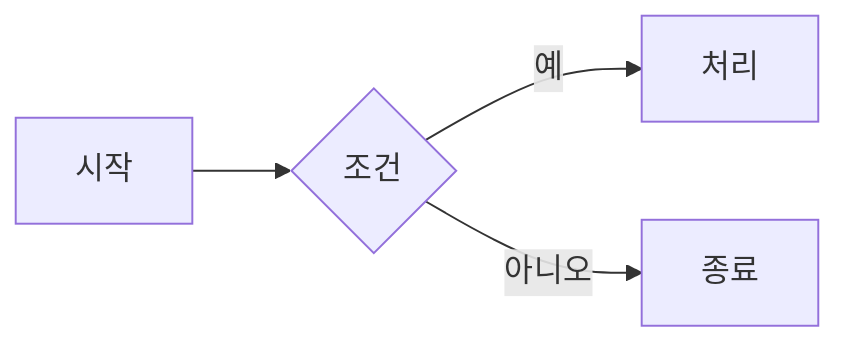

# 기초 마크다운(Markdown) 작성 가이드 — Azure DevOps 위키 포함

마크다운은 텍스트만으로 서식 있는 문서를 작성할 수 있는 경량 마크업 언어입니다.
이 가이드는 **공통 기본 문법(Part 1)** 과 **Azure DevOps(ADO) 위키 특화 문법(Part 2)** 으로 구성됩니다.

> ℹ️ ADO 위키는 표준 마크다운(CommonMark) + GitHub Flavored Markdown(GFM) 확장 + ADO 자체 확장을 함께 지원합니다.

---

# Part 1. 공통 기본 문법

## 1. 제목 (Headings)

`#` 기호 개수로 제목 단계를 나눕니다. (1~6단계)

```markdown
# 제목 1 (가장 큼)
## 제목 2
### 제목 3
#### 제목 4
##### 제목 5
###### 제목 6
```

> `#` 뒤에는 반드시 **공백 한 칸**을 넣어야 합니다.

---

## 2. 강조 (Emphasis)

| 서식 | 문법 | 결과 |
|------|------|------|
| 기울임 | `*기울임*` 또는 `_기울임_` | *기울임* |
| 굵게 | `**굵게**` 또는 `__굵게__` | **굵게** |
| 굵은 기울임 | `***굵은 기울임***` | ***굵은 기울임*** |
| 취소선 | `~~취소선~~` | ~~취소선~~ |

> ⚠️ 취소선(`~~`)은 GFM 확장 문법입니다. ADO 위키에서는 동작하지만 일부 구형 환경에서는 안 될 수 있습니다.

---

## 3. 목록 (Lists)

### 순서 없는 목록

```markdown
- 항목 1
- 항목 2
  - 하위 항목 (공백 2칸 들여쓰기)
```

### 순서 있는 목록

```markdown
1. 첫 번째
2. 두 번째
3. 세 번째
```

### 체크박스 (할 일 목록)

```markdown
- [x] 완료한 작업
- [ ] 해야 할 작업
```

> ℹ️ ADO 위키와 작업 항목(Work Item)에서는 체크박스가 렌더링 후 **클릭으로 직접 체크/해제** 가능합니다. (※ 이 인터랙티브 동작은 비교적 최근에 추가된 기능으로, 환경 버전에 따라 다를 수 있습니다.)

---

## 4. 링크와 이미지 (Links & Images)

```markdown
[링크 텍스트](https://example.com)

```

---

## 5. 코드 (Code)

### 인라인 코드

문장 중간에 \`백틱\`으로 감싸면 `코드`처럼 표시됩니다.

### 코드 블록

백틱 3개로 감싸고, 첫 줄에 언어를 지정하면 문법 강조가 됩니다.

````markdown
```python
def hello():
    print("Hello, Markdown!")
```
````

---

## 6. 인용 (Blockquote)

```markdown
> 인용문입니다.
> > 중첩 인용도 됩니다.
```

---

## 7. 표 (Table)

```markdown
| 항목 | 설명 | 비고 |
|------|------|------|
| A    | 내용 | -    |
```

정렬은 구분선의 콜론(`:`) 위치로 지정합니다.

```markdown
| 왼쪽 | 가운데 | 오른쪽 |
|:-----|:------:|-------:|
| L    | C      | R      |
```

> ℹ️ ADO 위키 표 셀 안에서 줄을 바꾸려면 `<br/>` 를 사용합니다. (셀 안에서는 Enter 줄바꿈이 적용되지 않음)

---

## 8. 구분선 / 줄바꿈 / 이스케이프

```markdown
---            (구분선)
\*별표 그대로\*  (이스케이프)
```

> ⚠️ **줄바꿈 주의:** ADO에서는 한 문단 안에서 줄만 바꾸려면 **줄 끝에 공백 2칸**을 넣거나 `<br/>` 를 써야 합니다. 그냥 Enter 한 번은 같은 문단으로 합쳐집니다. 문단을 나누려면 **빈 줄**을 넣으세요.

---

# Part 2. Azure DevOps 위키 특화 문법

> 아래 문법은 **표준 마크다운이 아닌 Azure DevOps 전용 확장**입니다. 위키(Wiki)와 일부는 작업 항목·PR에서도 동작하지만, 외부 마크다운 뷰어(GitHub, VS Code 등)에서는 렌더링되지 않습니다.

## 1. 목차 자동 생성 `[[_TOC_]]`

페이지 안에 아래 태그를 넣으면 제목(Heading) 기준으로 목차가 자동 생성됩니다.

```markdown
[[_TOC_]]
```

- 페이지에 제목(`#`)이 최소 1개 있어야 생성됩니다.
- 페이지 어디에 넣어도 되며, 보통 문서 맨 위에 둡니다.
- ⚠️ **대소문자를 구분합니다.** `[[_toc_]]` 는 동작하지 않을 수 있습니다.
- 첫 번째 `[[_TOC_]]` 만 렌더링되고 이후 것은 무시됩니다.
- HTML 제목 태그(`<h1>` 등)는 목차에 포함되지 않습니다. (마크다운 제목만 인식)

---

## 2. Mermaid 다이어그램

코드 블록 언어를 `mermaid` 로 지정하면 텍스트로 다이어그램을 그립니다.

````markdown

````

- 지원 예시 유형: 순서도(flowchart), 시퀀스(sequence), 간트(gantt), 클래스(class), 상태(state) 등
- ⚠️ ADO는 Mermaid 문법을 **제한적으로** 지원하며, **지원 버전·유형은 ADO 버전에 따라 다를 수 있습니다.** 최신 Mermaid 문법이 일부 안 될 수 있으니 실제 위키에서 미리보기로 확인하세요.

---

## 3. 작업 항목 링크 `#`

`#` 뒤에 작업 항목 번호를 입력하면 해당 Work Item으로 연결됩니다.

```markdown
이 변경은 #1234 작업과 관련됩니다.
```

> 입력 시 자동완성이 떠서 작업 항목을 선택할 수 있습니다.

---

## 4. 사용자/그룹 멘션 `@`

`@` 입력 후 사용자 또는 그룹을 선택하면 멘션되고, 해당 대상에게 **이메일 알림**이 갑니다.

```markdown
@홍길동 검토 부탁드립니다.
```

---

## 5. 이모지

```markdown
:smile: :rocket: :warning: :white_check_mark:
```

`:이모지명:` 형식으로 입력합니다. (위키·PR 코멘트에서 동작)

---

## 6. 이미지 크기 조절

표준 마크다운 이미지 문법에는 크기 지정이 없어, ADO에서는 HTML `` 태그를 사용합니다.

```markdown

```

---

## 7. 첨부 파일 (Attachments)

- 파일을 위키 편집기로 **드래그**하거나 클립보드에서 **붙여넣기** 하면 됩니다.
- ADO가 파일을 `.attachments` 폴더에 저장하고 마크다운 링크를 자동 삽입합니다.
- ℹ️ 첨부 기능은 **위키 전용**입니다. (PR에서는 동작 방식이 다름)

---

## 8. 페이지 내/외 앵커 링크

같은 페이지의 제목으로 이동하는 링크는 **모두 소문자 + 공백을 하이픈(-)으로** 바꿔 작성합니다.

```markdown
[작업 항목 링크 섹션으로 이동](#3-작업-항목-링크-)
```

다른 위키 페이지의 제목 참조:

```markdown
[다른 페이지의 제목](./대상페이지.md#heading-id)
```

> ⚠️ 앵커 ID는 **대소문자를 구분**하므로 제목이 대문자여도 링크는 소문자로 적어야 합니다.

---

## 9. YAML 메타데이터(Front Matter)

파일 맨 처음에 `---` 로 감싼 YAML 블록을 넣으면 위키에서 **머리글 1행 + 값 1행 표**로 렌더링됩니다.

```markdown
---
tags: [data, ado]
author: 홍길동
---
```

> ℹ️ 반드시 파일의 **가장 처음**에 와야 하며, 유효한 YAML이어야 합니다.

---

## 10. HTML 사용 / 제약 사항

- ADO 위키는 `<font>`, ``, `<br/>`, `<details>` 등 다양한 HTML 태그를 함께 쓸 수 있습니다.
- ⚠️ **JavaScript와 iframe은 지원되지 않습니다.** (카운트다운 타이머 등 인터랙티브 요소 임베드 불가)

---

# 부록: 위키 vs 보드(작업 항목) 차이

| 항목 | 위키(Wiki) | 보드 작업 항목(Work Item) |
|------|:----------:|:-------------------------:|
| 기본 마크다운 | ○ | ○ (※ 큰 텍스트 필드 한정) |
| `[[_TOC_]]` 목차 | ○ | ✕ (위키 전용) |
| 첨부 파일 | ○ | △ (방식 다름) |
| 기본 에디터 | 마크다운 | ※ 기본은 HTML, 필드별로 마크다운 전환 필요 |

> ⚠️ **작업 항목 마크다운은 비교적 최근 정식화된 기능**이라, 기본 에디터가 HTML로 되어 있고 필드마다 "마크다운으로 전환"을 해야 적용됩니다. 또한 **클라우드(dev.azure.com)와 온프레미스(Azure DevOps Server)의 지원 범위가 다를 수 있으니** 실제 고객사 환경에서 확인이 필요합니다.

---

## 학습 팁

1. 실제 ADO 위키에 **연습용 페이지**를 만들어 위 문법을 직접 입력해 보세요. 미리보기로 결과를 바로 비교할 수 있습니다.
2. ADO 위키 편집기 상단 **툴바**를 함께 활용하면 표·목록·이미지 삽입이 쉽습니다.
3. 공식 문서: `Markdown syntax for files, widgets, wikis (Microsoft Learn)` 에서 최신 지원 범위를 확인하세요.

---

*이 문서 자체도 마크다운으로 작성되었으니, 원본 텍스트와 렌더링 결과를 비교하며 학습하시면 도움이 됩니다.*
